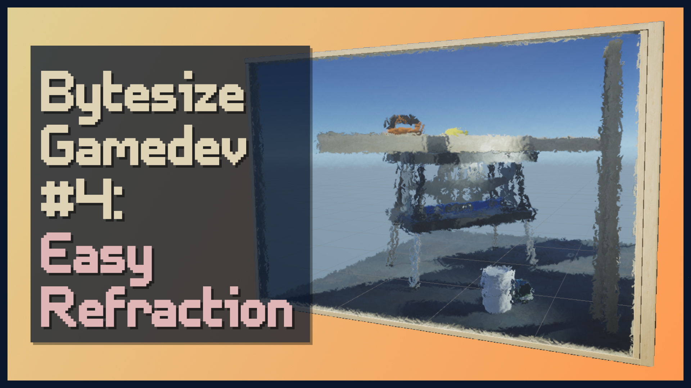

# Bytesize Gamedev: Quick Refraction in Shader Graph

A bytesize effect for simple glass-like refraction in Unity Shader Graph.

## Overview

The video to go along with this project will be released soon.

## Software

Made with Unity 2020.2.1f1 and URP/Shader Graph 10.2.2. The general concepts should work in most versions of Shader Graph.

## Authors

This project and the corresponding tutorial series were written by Daniel Ilett. [Follow him on Twitter](https://twitter.com/daniel_ilett) for more gamedev tutorials!

## Release

This project was released on February 12th 2021.
